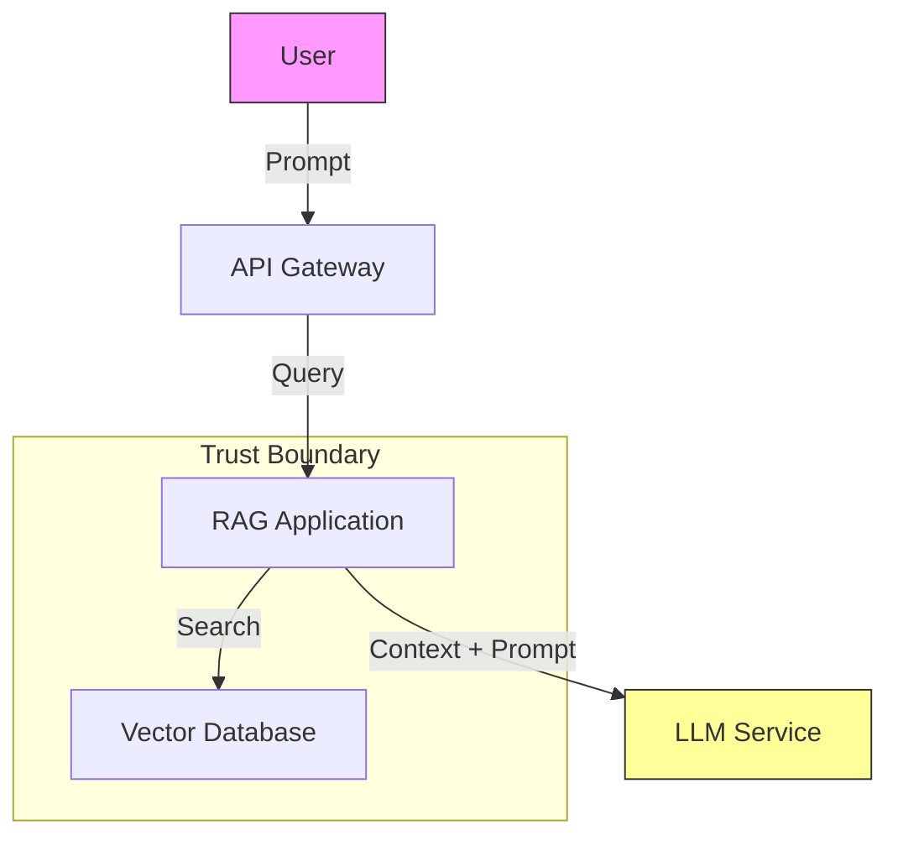

# AI Threat Modeling: Securing AI Systems by Design

## 🎯 Introduction

AI systems introduce new attack surfaces. Traditional threat modeling (STRIDE) isn't enough. We need AI-specific threat modeling.

## 🚨 AI Attack Surface

1. **Data Pipeline**: Poisoning, leakage
2. **Model**: Extraction, inversion, backdoors
3. **Inference**: Prompt injection, evasion
4. **Infrastructure**: GPU access, API keys

---

## 🛡️ STRIDE for AI

| Threat | AI Specific Example | Mitigation |
|:---|:---|:---|
| **Spoofing** | Impersonating a user to access LLM | Strong auth (OIDC), mTLS |
| **Tampering** | Model poisoning, prompt injection | Input validation, signing artifacts |
| **Repudiation** | "I didn't generate that deepfake" | Watermarking, audit logs |
| **Information Disclosure** | Training data leakage (PII) | Differential privacy, PII scrubbing |
| **Denial of Service** | Model exhaustion (complex prompts) | Rate limiting, timeout, cost limits |
| **Elevation of Privilege** | Jailbreaking to get system prompt | Sandboxing, guardrails |

---

## 📝 Threat Modeling Process

### 1. Decompose the System

- **Data Sources**: Where does data come from?
- **Training Environment**: Where is the model trained?
- **Model Artifacts**: Where are weights stored?
- **Inference API**: How is the model accessed?

### 2. Identify Threats (OWASP LLM Top 10)

1. **Prompt Injection**
2. **Insecure Output Handling**
3. **Training Data Poisoning**
4. **Model Denial of Service**
5. **Supply Chain Vulnerabilities**
6. **Sensitive Information Disclosure**
7. **Insecure Plugin Design**
8. **Excessive Agency**
9. **Overreliance**
10. **Model Theft**

### 3. Determine Mitigations

**Example: RAG Chatbot**

| Component | Threat | Mitigation |
|:---|:---|:---|
| **User Input** | Prompt Injection | NeMo Guardrails, Input Validation |
| **Vector DB** | Data Leakage | RBAC, Encryption at Rest |
| **LLM API** | DoS / Cost | Rate Limiting, Budget Alerts |
| **Output** | XSS / Injection | Output Encoding, Content Filtering |

---

## 🎯 Example Threat Model (RAG App)

**Threats**:
1. **User -> API**: DoS attack (send huge prompts)
2. **API -> App**: Injection (bypass auth)
3. **App -> VectorDB**: Unauthorized access (read all docs)
4. **App -> LLM**: Prompt injection (leak system prompt)
5. **LLM -> App**: Malicious output (XSS payload)

**Mitigations**:
1. **Rate Limiting** on API
2. **Input Validation** on App
3. **RBAC** on VectorDB
4. **Guardrails** on LLM inputs
5. **Output Sanitization** on App

---

## ✅ Best Practices

- [ ] Perform threat modeling early
- [ ] Use OWASP LLM Top 10
- [ ] Map data flows
- [ ] Identify trust boundaries
- [ ] Document mitigations
- [ ] Review regularly

---

**Next**: [Guardrails Architecture](./guardrails-architecture.md).
